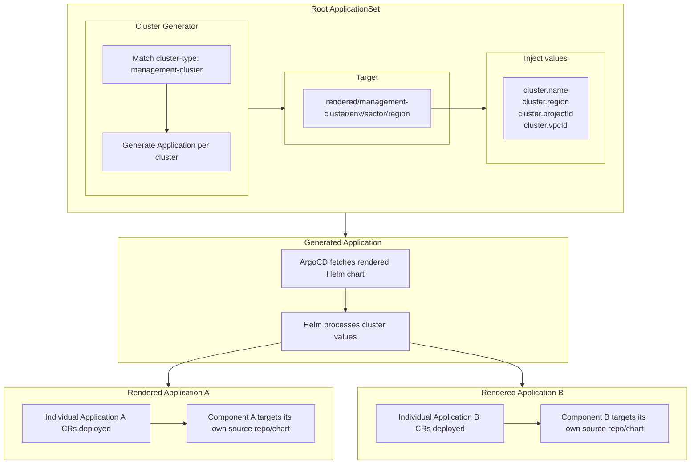
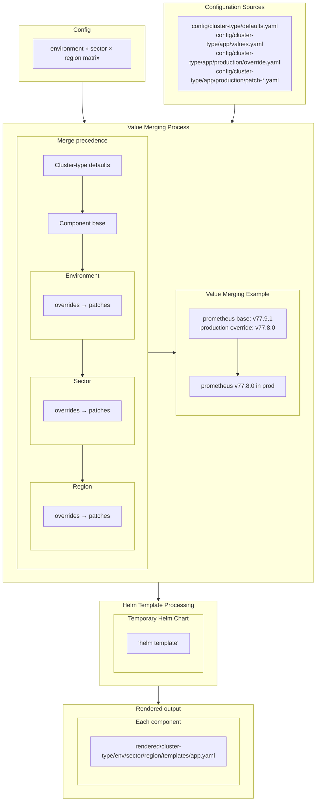

# GitOps Fleet Management System

A multi-dimensional GitOps fleet management system that generates ArgoCD applications for complex deployment hierarchies across environments, sectors, and regions.

## Architecture Overview

This repository implements a **source-to-target generation pattern** where:

1. **Source Configuration**: Simple, maintainable application definitions with environment overrides
2. **Generation Process**: Python generator merges values and creates ArgoCD Applications via Helm
3. **Target Deployment**: Generated manifests deployed via ApplicationSets to appropriate clusters
4. **Promotion Flow**: Changes progress through dimensional hierarchy with validation gates

### Bootstrap and Deployment Flow



### Config to Rendered Generation



### Key Benefits

- **Multi-dimensional deployment**: Environment/sector/region hierarchy
- **Progressive rollouts**: Changes advance through validation gates
- **Audit trail**: Git tracks exact deployment manifests per target
- **Conflict resolution**: Full regeneration eliminates configuration drift
- **Team collaboration**: Self-service application management with OWNERS files

## Repository Structure

```
gcp-hcp-apps/
├── config/                           # Source configuration
│   ├── config.yaml                   # Global fleet configuration
│   └── management-cluster/           # Cluster type organization
│       ├── application-defaults.yaml # Default ArgoCD settings
│       ├── prometheus/               # Application configuration
│       │   ├── metadata.yaml         # App metadata & ownership
│       │   ├── values.yaml           # Base configuration
│       │   └── production/           # Environment overrides
│       │       └── values.yaml
│       └── cert-manager/
│           ├── metadata.yaml
│           └── values.yaml
├── rendered/                         # Generated ArgoCD Applications
│   └── management-cluster/
│       ├── integration/int-sector-1/us-central1/
│       │   ├── Chart.yaml
│       │   ├── values.yaml           # Aggregated config
│       │   └── templates/
│       │       ├── prometheus.yaml   # ArgoCD Application
│       │       └── cert-manager.yaml
│       └── production/prod-sector-1/us-east1/
├── templates/                        # Base Helm templates
│   ├── Chart.yaml
│   └── argocd-resources.yaml         # ArgoCD Application and ApplicationSet template
├── hack/                             # Development tools
│   ├── generate.py                   # Fleet generator
│   └── test_generate.py              # Test suite
└── Makefile                          # Build targets
```

## Usage

### Quick Start

```bash
# Generate all ArgoCD applications
make generate

# Run tests
make test

# Manual generation
uv run hack/generate.py
```

### Development Workflow

1. **Modify Configuration**: Edit files in `config/`
2. **Generate**: Run `make generate` to update `rendered/`
3. **Validate**: Ensure no unexpected changes in generated output
4. **Submit PR**: Include both config changes and generated manifests
5. **Deploy**: ApplicationSets automatically sync from `rendered/`

### Adding New Applications

1. **Create Configuration**:

   ```bash
   mkdir -p config/management-cluster/my-app
   ```

2. **Add Metadata** (`config/management-cluster/my-app/metadata.yaml`):

   ```yaml
   name: my-app
   description: "My application description"
   owners:
     - team-platform@example.com
   ```

3. **Configure Application** (`config/management-cluster/my-app/values.yaml`):

   ```yaml
   applications:
     my-app:
       source:
         repoURL: https://charts.example.com
         targetRevision: "1.0.0"
         chart: my-app
         helm:
           valuesObject:
             replicas: 1
       destination:
         namespace: my-namespace
       syncPolicy:
         syncOptions:
           - CreateNamespace=true
   ```

4. **Add to Fleet** (`config/config.yaml`):

   ```yaml
   cluster_types:
     - name: management-cluster
       applications:
         - prometheus
         - cert-manager
         - my-app  # Add here
   ```

5. **Generate**: `make generate`

### Environment Overrides

Create permanent dimensional configurations:

```bash
# Production overrides
mkdir -p config/management-cluster/my-app/production
cat > config/management-cluster/my-app/production/override.yaml << EOF
applications:
  my-app:
    source:
      targetRevision: "0.9.0"  # Stable version
      helm:
        valuesObject:
          replicas: 3
          resources:
            requests:
              memory: "1Gi"
              cpu: "500m"
EOF
```

### Patch System

Enables temporary changes that roll through the fleet progressively:

#### File Types
- **`values.yaml`**: Base application configuration
- **`override.yaml`**: Permanent dimensional overrides
- **`patch-NNN.yaml`**: Temporary rolling changes

#### Creating and Promoting Patches

```bash
# Create sector-level patch
cat > config/management-cluster/cert-manager/integration/int-sector-1/patch-001.yaml << EOF
metadata:
  description: "Upgrade cert-manager to v1.16.0"

applications:
  cert-manager:
    source:
      targetRevision: "v1.16.0"
EOF
```

Once this first patch is applied, you can promote it to the next level

```bash
# Promote patch through dimensions using the promotion tool
uv run hack/promote.py management-cluster cert-manager patch-001
```

#### Automated Promotion Flow

The `promote.py` tool handles patch progression:

1. **Promotes** patches to next dimensional level (sectors minimum)
2. **Coalesces** patches when all child dimensions are patched
3. **Integrates** into `values.yaml` when all environments are patched
4. **Detects gaps** and prevents promotion with missing patches
5. **Validates** no target conflicts before promotion

Includes conflict detection and warns about overlapping configuration paths.

### Fleet Configuration

The fleet hierarchy is defined in `config/config.yaml`:

```yaml
# Dimensional hierarchy
sequence:
  environments:
    - name: integration
      sectors:
        - name: int-sector-1
          regions: [us-central1, europe-west1]
    - name: production
      promotion: manual  # Gate between environments
      sectors:
        - name: prod-sector-1
          regions: [us-east1, europe-east1]

# Cluster types and applications
cluster_types:
  - name: management-cluster
    applications: [prometheus, cert-manager]
```

## ApplicationSet Integration

The generated manifests are consumed by ApplicationSets:

```yaml
apiVersion: argoproj.io/v1alpha1
kind: ApplicationSet
metadata:
  name: management-cluster-apps
spec:
  generators:
    - clusters:
        selector:
          matchLabels:
            cluster-type: management-cluster
  template:
    spec:
      source:
        repoURL: https://github.com/your-org/gcp-hcp-apps.git
        path: "rendered/management-cluster/{{values.environment}}/{{values.sector}}/{{values.region}}"
        helm:
          valuesObject:
            cluster:
              name: "{{.name}}"
              region: "{{metadata.labels.region}}"
              projectId: "{{metadata.labels.projectId}}"
```

## Promotion & Validation

Changes flow through the dimensional hierarchy:

1. **Development**: Start in `integration/int-sector-1/us-central1`
2. **Validation**: External validation component checks deployment health (future)
3. **Promotion**: Advance to next dimension with manual gates (automation planned)
4. **Production**: Reach `production/prod-sector-1/us-east1`

The fleet configuration supports promotion rules, though automated promotion is not yet implemented.

### CI/CD Validation

```bash
# Ensure generation is current
make generate
if git diff --exit-code rendered/; then
  echo "✓ Generated files are current"
else
  echo "✗ Generated files are stale. Run 'make generate'"
  exit 1
fi
```

## Generator Details

The Python generator (`hack/generate.py`):

- **Target Discovery**: Finds all environment/sector/region combinations from `config.yaml`
- **Value Merging**: Deep merge with precedence: defaults → base → environment → sector → region (override.yaml then patch-*.yaml at each level)
- **Template Processing**: Uses Helm to generate final ArgoCD Applications
- **Validation**: Fails fast on missing mandatory files
- **Output**: Creates one YAML file per application in `rendered/` hierarchy
- **Idempotent**: Re-running on unchanged sources produces no file changes

### Value Merging Order

1. Application defaults (`defaults.yaml`)
2. Base application values (`values.yaml`)
3. Environment level: `override.yaml` then `patch-*.yaml`
4. Sector level: `override.yaml` then `patch-*.yaml`
5. Region level: `override.yaml` then `patch-*.yaml`

## Testing

Comprehensive test suite covers:

- Target discovery from fleet configuration
- Value merging logic
- Application discovery
- Integration tests with real configs
- Validation & error handling

```bash
# Run all tests
make test

# Run specific test
uv run hack/test_generate.py::TestValidation -v
```

## Cluster Value Injection

Applications can reference dynamic cluster metadata using template syntax:

```yaml
applications:
  my-app:
    destination:
      name: '{{ .Values.cluster.name }}'
    source:
      helm:
        valuesObject:
          cluster:
            region: '{{ .Values.cluster.region }}'
            projectId: '{{ .Values.cluster.projectId }}'
            vpcId: '{{ .Values.cluster.vpcId }}'
```

The ApplicationSet injects cluster metadata that becomes available as `.Values.cluster.*` during Helm processing.

## Repository Evolution

This system handles both configuration changes and structural evolution:

- **Adding/removing applications**: Update `config.yaml` and regenerate
- **Changing resource structures**: Modify templates and regenerate all targets
- **Updating CRD schemas**: Templates adapt automatically via Helm processing
- **Modifying deployment patterns**: Generator ensures consistency across all dimensions

The source-to-target pattern eliminates configuration drift by regenerating complete manifests rather than applying incremental patches.
