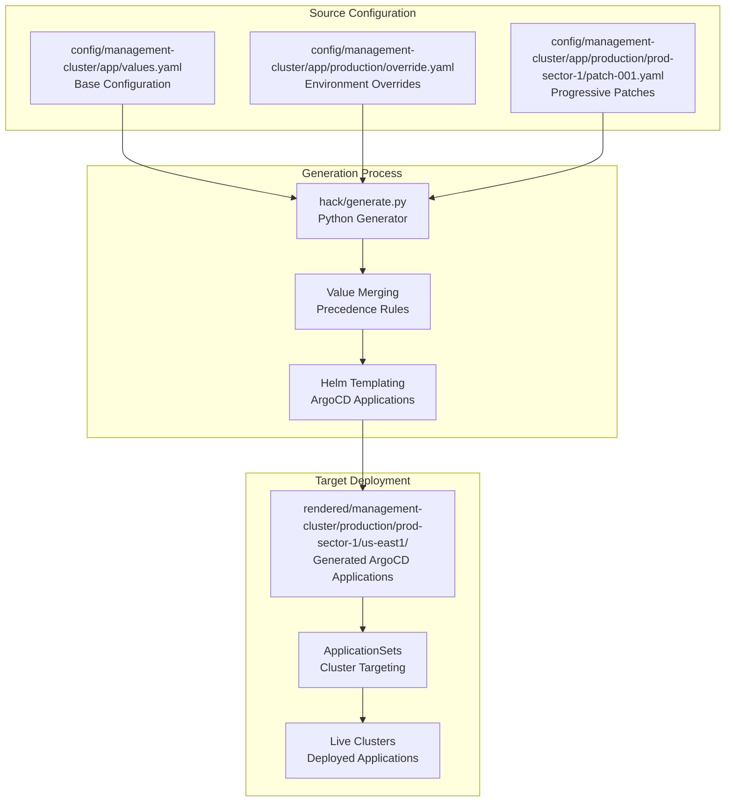

# GitOps Fleet Management System Walkthrough

*A comprehensive guide to enterprise-scale multi-dimensional GitOps deployment*

---

## 1. The Problem Statement

### Enterprise-Scale Deployment Challenges

In modern enterprise environments, organizations face increasingly complex deployment scenarios that traditional approaches cannot effectively address:

#### The Bootstrap Problem
- **Challenge**: How do you deploy and manage applications across dozens or hundreds of Kubernetes clusters?
- **Reality**: Management clusters need critical applications (ArgoCD, Prometheus, cert-manager, Hypershift) deployed consistently across multiple environments, sectors, and regions
- **Complexity**: Each deployment target has unique requirements (production vs development resources, region-specific configurations, gradual rollouts)

#### Configuration Management at Scale
- **The Duplication Trap**: Copy-pasting YAML files for each environment leads to maintenance nightmares
- **Override Hell**: Attempting to manage environment-specific differences becomes unwieldy
- **Drift Risk**: Manual changes and inconsistent configurations create security and reliability issues
- **Audit Requirements**: Compliance demands knowing exactly what is deployed where, when, and by whom

#### Progressive Rollout Requirements
- **Safety Gates**: Changes must advance through environments with validation checkpoints
- **Blast Radius Control**: Failures should be contained within specific dimensions (sectors/regions)
- **Rollback Capability**: Quick reversion when issues are detected
- **Coordinated Updates**: Rolling out security patches or feature updates across the entire fleet safely

### Why Simpler Solutions Fall Short

#### Manual Application Management
```yaml
# ❌ Problem: Doesn't scale beyond a few clusters
kubectl apply -f prometheus-dev.yaml
kubectl apply -f prometheus-staging.yaml
kubectl apply -f prometheus-prod.yaml
```
- **Scaling Issues**: Manually managing hundreds of clusters is impossible
- **Consistency Problems**: Human error leads to configuration drift
- **No Audit Trail**: Changes aren't tracked or reviewable

#### Basic ArgoCD ApplicationSets
```yaml
# ❌ Problem: Too simplistic for complex hierarchies
apiVersion: argoproj.io/v1alpha1
kind: ApplicationSet
metadata:
  name: simple-apps
spec:
  generators:
  - clusters: {}  # Deploys to ALL clusters identically
```
- **No Dimensional Control**: Can't handle environment/sector/region hierarchies
- **No Progressive Rollouts**: All clusters get changes simultaneously
- **Limited Override Capability**: Can't easily customize per dimension

#### Centralized ArgoCD Progressive Rollout Solutions
```yaml
# ❌ Problem: Creates single point of failure and scalability issues
# ArgoCD Rollouts or similar centralized progressive deployment tools
```
- **Single Point of Failure**: Central ArgoCD controls everything, becomes critical bottleneck
- **Scalability Concerns**: One instance managing hundreds of clusters doesn't scale
- **Connectivity Requirements**: Central instance needs network access to all regions/clusters
- **Security Risk**: Single point with credentials/permissions to entire fleet
- **Regional Autonomy Lost**: Regions can't operate independently during network partitions

#### Direct YAML Management
```yaml
# ❌ Problem: Configuration explosion and drift
environments/
├── dev/
│   ├── cluster1-prometheus.yaml      # 500 lines
│   ├── cluster2-prometheus.yaml      # 500 lines (95% duplicate)
│   └── cluster3-prometheus.yaml      # 500 lines (95% duplicate)
├── staging/
│   ├── cluster4-prometheus.yaml      # 500 lines (90% duplicate)
│   └── cluster5-prometheus.yaml      # 500 lines (90% duplicate)
└── production/
    ├── cluster6-prometheus.yaml      # 500 lines (90% duplicate)
    └── cluster7-prometheus.yaml      # 500 lines (90% duplicate)
```
- **Maintenance Nightmare**: Updating common settings requires touching dozens of files
- **Inconsistency Risk**: Easy to miss updating some files
- **No Relationship Tracking**: Hard to understand what differs between environments

#### GitOps Principle: Source of Truth Transparency
A core GitOps principle requires that **Git contains the exact manifests that will be applied to clusters**:

```yaml
# ❌ Problem: Git contains only source templates, not what actually gets deployed
config/
└── app-template.yaml          # What's in Git
    spec:
      image: "{{ .Values.image }}"  # Templated - unclear what deploys

# ✅ Solution: Git contains both source AND rendered manifests
config/
└── app-template.yaml          # Source configuration
rendered/
└── production/us-east1/
    └── app.yaml               # Exact manifest that deploys
        spec:
          image: "myapp:v1.2.3"  # Concrete - exactly what runs
```

**Why This Matters:**
- **Change Impact Visibility**: `git diff rendered/` shows exactly what will change in clusters
- **Audit Trail**: Git history contains complete deployment records
- **Troubleshooting**: Compare running state to committed rendered manifests
- **Rollback Capability**: Revert to any previous exact deployment state
- **Review Process**: Teams can review actual deployment manifests, not just templates

#### The Enterprise Reality
Modern organizations need:
- **100+ Kubernetes clusters** across multiple environments and regions
- **Consistent application deployment** with environment-specific customizations
- **Progressive rollout capabilities** with safety gates
- **Full audit trail** for compliance and troubleshooting
- **GitOps transparency** where Git shows exactly what deploys to each cluster
- **Multi-team collaboration** with clear ownership and autonomous application management
- **Team autonomy** where application owners can manage their own rollouts without central coordination overhead

---

## 2. Solution Overview

### The Source-to-Target Generation Pattern

Our GitOps fleet management system implements a **source-to-target generation pattern** that solves enterprise deployment challenges through a structured, scalable approach:



### Core Concepts

#### 1. Multi-Dimensional Hierarchy
Instead of flat environment lists, we model deployment targets as a **dimensional matrix**:

```yaml
# config/config.yaml
sequence:
  environments:
    - name: integration      # → Development/testing
      sectors:
        - name: int-sector-1 # → Isolated failure domains
          regions:           # → Geographic distribution
            - us-central1
            - europe-west1
    - name: production       # → Production workloads
      promotion: manual      # → Safety gate
      sectors:
        - name: prod-canary  # → Canary deployments
          regions: [us-east1]
        - name: prod-sector-1 # → Full production
          regions: [us-east1, europe-east1]
```

**Why This Matters:**
- **Blast Radius Control**: Issues contained within dimensions
- **Progressive Rollouts**: Changes advance through the hierarchy
- **Geographic Distribution**: Region-specific configurations
- **Rollout Efficiency**: Sectors group regions into manageable rollout units, enabling faster progression through the system

#### 2. Value Merging with Precedence
Configuration follows a **clear precedence order** to avoid conflicts:

```
defaults.yaml → base values.yaml → environment override.yaml → sector override.yaml → region override.yaml
     ↓              ↓                        ↓                      ↓                     ↓
  Common        Base App              Production              Sector-specific        Region-specific
 Defaults      Settings             Stability Settings        Customizations         Customizations
```

#### 3. Patch-Based Progressive Rollouts
Rolling changes use a **patch system** that enables controlled progression through the dimensional hierarchy:

```bash
# Phase 1: Start in canary region
config/management-cluster/app/production/prod-canary/us-east1/patch-001.yaml

# Phase 2: Promote to sector level (after validation)
config/management-cluster/app/production/prod-sector-1/patch-001.yaml

# Phase 3: Promote to environment level
config/management-cluster/app/production/patch-001.yaml

# Phase 4: Integrate into base (after full validation)
# Patch content merged into values.yaml, patch files deleted
```

#### 4. Full GitOps Audit Trail
Every deployment is **tracked in Git**:
- **Source Changes**: All configuration modifications in `config/`
- **Generated Manifests**: Complete ArgoCD Applications committed to `rendered/`
- **Deployment History**: Git log shows exactly what was deployed when
- **Rollback Capability**: Revert changes via `git revert` (creates new commit undoing changes)

#### 5. Autonomous Regional Operation
Unlike centralized solutions, this system enables **regional autonomy**:
- **Distributed ArgoCD**: Each region runs its own ArgoCD instance
- **Git-Based Coordination**: Progressive rollouts coordinated through Git commits, not central control
- **Network Independence**: Regions operate independently during connectivity issues
- **Security Isolation**: Each region only needs credentials for its own clusters
- **Scalable Architecture**: No single bottleneck as fleet grows

#### 6. Team-Level Application Autonomy
The folder hierarchy enables **application team independence**:
- **Application Ownership**: Teams own their entire `config/management-cluster/{app-name}/` folder structure
- **Self-Service Rollouts**: Teams create and manage their own patches within application boundaries
- **Independent Release Cycles**: Applications can be updated without coordinating with other teams
- **Clear Responsibility**: `metadata.yaml` establishes ownership and team contact information
- **Autonomous Testing**: Teams control their own progressive rollout validation and promotion timing

### Technology Stack
- **Configuration**: YAML-based declarative configuration
- **Generation**: Python with PyYAML for processing
- **Templating**: Helm for ArgoCD Application generation
- **Deployment**: Distributed ArgoCD ApplicationSets for autonomous cluster targeting
- **Version Control**: Git for complete audit trail and coordination

---

## 3. Detailed Walkthrough

### Repository Structure Deep Dive

Let's examine how the system is organized:

```
gcp-hcp-apps/
├── config/                          # 📝 Source of Truth
│   ├── config.yaml                  # Fleet dimensional hierarchy
│   └── management-cluster/          # Cluster type organization
│       ├── defaults.yaml            # Common ArgoCD Application defaults
│       ├── prometheus/              # Application-specific configuration
│       │   ├── metadata.yaml        # Ownership and description
│       │   ├── values.yaml          # Base configuration
│       │   └── production/          # Environment-specific overrides
│       │       └── override.yaml
│       └── cert-manager/
│           ├── metadata.yaml
│           ├── values.yaml
│           ├── integration/         # Integration environment
│           │   ├── patch-001.yaml   # Rolling change (environment level)
│           │   └── patch-002.yaml   # Another rolling change (validated in integration)
│           └── stage/               # Stage environment
│               ├── override.yaml    # Stage-specific permanent config
│               └── stage-sector-1/  # Sector-level patches
│                   ├── patch-001.yaml  # patch-001 promoted from integration
│                   └── us-east1/    # Region-level patches
│                       └── patch-002.yaml  # patch-002 being tested in specific region
│
├── rendered/                        # 🎯 Generated Targets (Committed to Git)
│   └── management-cluster/
│       ├── integration/int-sector-1/us-central1/
│       │   ├── Chart.yaml           # Helm chart metadata
│       │   ├── values.yaml          # Aggregated configuration
│       │   └── templates/           # Individual ArgoCD Applications
│       │       ├── prometheus.yaml
│       │       └── cert-manager.yaml
│       ├── stage/                   # Stage environment targets
│       │   ├── stage-sector-1/
│       │   │   ├── us-east1/
│       │   │   │   ├── Chart.yaml
│       │   │   │   ├── values.yaml  # Includes patch-001 + patch-002 from region level
│       │   │   │   └── templates/
│       │   │   │       ├── prometheus.yaml
│       │   │   │       └── cert-manager.yaml
│       │   │   └── europe-west1/
│       │   │       ├── Chart.yaml
│       │   │       ├── values.yaml  # Includes patch-001 from sector level only
│       │   │       └── templates/
│       │   │           ├── prometheus.yaml
│       │   │           └── cert-manager.yaml
│       │   └── stage-sector-2/ap-east1/
│       │       ├── Chart.yaml
│       │       ├── values.yaml      # Clean config (no patches yet)
│       │       └── templates/
│       │           ├── prometheus.yaml
│       │           └── cert-manager.yaml
│       └── production/prod-sector-1/us-east1/
│           └── templates/
│               ├── prometheus.yaml  # Production-configured app
│               └── cert-manager.yaml
│
├── argocd-apps/                     # 🎨 Helm Templates
│   ├── Chart.yaml                   # Template chart definition
│   └── templates/
│       ├── applications.yaml        # ArgoCD Application template
│       └── applicationsets.yaml     # ApplicationSet template
│
└── hack/                            # 🔧 Tools and Scripts
    ├── generate.py                  # Main generator script
    ├── promote.py                   # Patch promotion tool
    └── test_generate.py             # Comprehensive test suite
```

### Step 1: Configuration Structure

#### Cluster-Type Defaults
All applications start with common defaults for the cluster type:

```yaml
# config/management-cluster/defaults.yaml
applications:
  default:
    project: default
    namespace: argocd
    finalizers:
      - resources-finalizer.argocd.argoproj.io
    syncPolicy:
      automated:
        prune: false
        selfHeal: true
      syncOptions:
        - CreateNamespace=true
    destination:
      name: "{{ .Values.cluster.name }}"  # Injected by ApplicationSet
```

These defaults provide:
- **Common ArgoCD settings** applied to all applications by default
- **Safety controls** like `prune: false` to prevent accidents
- **Cluster targeting** via templated destination names
- **Consistent project and namespace** organization

#### Application Base Configuration
Every application starts with base configuration:

```yaml
# config/management-cluster/cert-manager/values.yaml
applications:
  cert-manager:
    source:
      repoURL: https://charts.jetstack.io
      targetRevision: "v1.18.2"  # Base version
      chart: cert-manager
      helm:
        valuesObject:
          crds:
            enabled: true
          prometheus:
            enabled: true
    destination:
      namespace: cert-manager
    syncPolicy:
      syncOptions:
        - CreateNamespace=true
```

#### Dimensional Overrides
Overrides can be created at **any dimensional level** and apply to all child targets beneath them:

**Environment-Level Override** (applies to all sectors/regions in production):

```yaml
# config/management-cluster/cert-manager/production/override.yaml
applications:
  cert-manager:
    source:
      targetRevision: "v1.17.0"  # Stable version (not bleeding edge)
      helm:
        valuesObject:
          resources:
            requests:
              memory: "512Mi"     # Production resource allocation
              cpu: "100m"
          replicaCount: 3         # High availability
```

**Sector-Level Override** (applies only to regions within prod-sector-1):
```yaml
# config/management-cluster/cert-manager/production/prod-sector-1/override.yaml
applications:
  cert-manager:
    source:
      helm:
        valuesObject:
          webhook:
            securePort: 10270   # Sector-specific port configuration
```

**Region-Level Override** (applies only to us-east1 within prod-sector-1):
```yaml
# config/management-cluster/cert-manager/production/prod-sector-1/us-east1/override.yaml
applications:
  cert-manager:
    source:
      helm:
        valuesObject:
          nodeSelector:
            region: us-east1    # Region-specific node placement
```

This hierarchical override system enables:
- **Environment-wide policies** (production stability settings)
- **Sector-specific customizations** (different business unit requirements)
- **Regional adaptations** (compliance, performance, or infrastructure differences)

#### Progressive Patches
Like overrides, patches can be created at **any dimensional level** and apply to all child targets beneath them. Patches enable rolling changes that progress through the hierarchy:

```yaml
# config/management-cluster/cert-manager/integration/patch-001.yaml
metadata:
  description: "Upgrade cert-manager to v1.16.0"

applications:
  cert-manager:
    source:
      targetRevision: "v1.16.0"  # New version being tested
```

The patch system enables controlled progression from specific regions → sectors → environments → final integration into base `values.yaml`.

### Step 2: Generation Process

#### Target Discovery
The [generator](hack/generate.py) discovers all deployment targets by reading the dimensional matrix from [`config/config.yaml`](config/config.yaml) and generating every complete environment/sector/region combination.

For example, from the configuration:
- `integration/int-sector-1/us-central1`
- `integration/int-sector-1/europe-west1`
- `production/prod-sector-1/us-east1`
- `production/prod-sector-1/europe-east1`

#### Value Merging Algorithm
The [generator](hack/generate.py) merges configuration following strict precedence rules:

1. **Start with cluster-type defaults** (`defaults.yaml`)
2. **Apply base component values** (`values.yaml`)
3. **Walk through each dimensional level** (environment → sector → region):
   - Apply permanent `override.yaml` files first
   - Apply `patch-*.yaml` files second (in filename order)

This creates a final merged configuration for each target where more specific dimensions override broader ones, enabling precise control over what gets deployed where.

#### Helm Template Processing
The [generator](hack/generate.py) uses Helm to create the final ArgoCD Applications:

1. **Merge all component values** for the specific target (cert-manager, prometheus, etc.)
2. **Create temporary values file** with the merged configuration
3. **Run `helm template`** using the [ArgoCD application templates](argocd-apps/templates/)
4. **Output individual YAML files** to `rendered/{cluster-type}/{environment}/{sector}/{region}/`

This process transforms the merged configuration into concrete ArgoCD Application and ApplicationSet manifests that can be deployed by ArgoCD.

### Step 3: Generated Output

#### Target-Specific ArgoCD Applications
Each dimensional target gets its own ArgoCD Application manifest for every application defined in the cluster type. Here's an example for cert-manager:

```yaml
# rendered/management-cluster/production/prod-sector-1/us-east1/templates/cert-manager.yaml
apiVersion: argoproj.io/v1alpha1
kind: Application
metadata:
  name: cert-manager
  namespace: argocd
  finalizers:
  - resources-finalizer.argocd.argoproj.io
spec:
  project: default
  source:
    chart: cert-manager
    helm:
      valuesObject:
        crds:
          enabled: true
        prometheus:
          enabled: true
        resources:              # From production override
          requests:
            memory: "512Mi"
            cpu: "100m"
        replicaCount: 3         # From production override
    repoURL: https://charts.jetstack.io
    targetRevision: "v1.17.0"  # From production override (stable version)
  destination:
    name: '{{ .Values.cluster.name }}'  # Injected by ApplicationSet
    namespace: cert-manager
  syncPolicy:
    automated:
      prune: false
      selfHeal: true
    syncOptions:
    - CreateNamespace=true
```

Similar manifests are generated for every other application in the cluster type (prometheus, argocd, hypershift, etc.), each with their own merged configuration for this specific target.

#### Aggregated Configuration
Each target also includes aggregated values for transparency:

```yaml
# rendered/management-cluster/production/prod-sector-1/us-east1/values.yaml
applications:
  cert-manager:
    project: default           # From defaults.yaml
    namespace: argocd          # From defaults.yaml
    finalizers:                # From defaults.yaml
      - resources-finalizer.argocd.argoproj.io
    source:
      repoURL: https://charts.jetstack.io
      targetRevision: "v1.17.0"  # From production/override.yaml
      chart: cert-manager
      helm:
        valuesObject:
          crds:
            enabled: true       # From values.yaml
          prometheus:
            enabled: true       # From values.yaml
          resources:            # From production/override.yaml
            requests:
              memory: "512Mi"
              cpu: "100m"
          replicaCount: 3       # From production/override.yaml
    destination:
      name: '{{ .Values.cluster.name }}'
      namespace: cert-manager
```

### Step 4: Deployment Flow

#### ApplicationSet Bootstrap Architecture
The ApplicationSets that consume the generated manifests are **part of this repository** under [`config/infra-cluster/`](config/infra-cluster/):

**Bootstrap Process:**
1. **Region creation** installs the root ApplicationSet from [`config/infra-cluster/infra-cluster-root/values.yaml`](config/infra-cluster/infra-cluster-root/values.yaml)
2. **Root ApplicationSet** auto-discovers infra-clusters and deploys other ApplicationSets defined under `infra-cluster/`
3. **Management-cluster ApplicationSets** (deployed by step 2) target management clusters and deploy applications from `rendered/management-cluster/`

The missing piece: ApplicationSets like [`config/infra-cluster/management-cluster-root/values.yaml`](config/infra-cluster/management-cluster-root/values.yaml) that specifically target management clusters and consume the generated charts.

**Root ApplicationSet** (deployed during bootstrap):
```yaml
# Generated from config/infra-cluster/infra-cluster-root/values.yaml
apiVersion: argoproj.io/v1alpha1
kind: ApplicationSet
metadata:
  name: infra-cluster-root
spec:
  generators:
  - clusters:
      selector:
        matchLabels:
          gcp-hcp/cluster-type: infra-cluster
  template:
    spec:
      source:
        repoURL: https://github.com/company/gcp-hcp-apps
        path: "rendered/infra-cluster/{{ .Values.cluster.environment }}/{{ .Values.cluster.sector }}/{{ .Values.cluster.region }}"
        helm:
          valuesObject:
            cluster:
              region: "{{ .Values.cluster.region }}"
              environment: "{{ .Values.cluster.environment }}"
              projectId: "{{ index .metadata.annotations \"gcp-hcp/project-id\" }}"
```

This creates a **self-updating bootstrap system** where the initial ApplicationSet pulls in additional ApplicationSets that manage the entire fleet.

#### Cluster Value Injection
Cluster-specific metadata is injected at deployment time:

```yaml
# In generated applications, these get resolved:
destination:
  name: '{{ .Values.cluster.name }}'     # → "prod-us-east1-mgmt-001"

# In Helm values, these get resolved:
helm:
  valuesObject:
    cluster:
      region: '{{ .Values.cluster.region }}'      # → "us-east1"
      projectId: '{{ .Values.cluster.projectId }}' # → "prod-gcp-project-123"
      vpcId: '{{ .Values.cluster.vpcId }}'        # → "vpc-prod-us-east1"
```

### Step 5: Progressive Rollout Workflow

#### Creating a Patch
When you need to roll out a change (like a security update):

```bash
# 1. Start in integration sector first (proper progression)
cat > config/management-cluster/cert-manager/integration/int-sector-1/patch-001.yaml << EOF
metadata:
  description: "Security update: cert-manager v1.19.0"

applications:
  cert-manager:
    source:
      targetRevision: "v1.19.0"
EOF

# 2. Generate and test
make generate
git diff rendered/  # Review changes

# 3. Deploy to integration sector first
git add config/ rendered/
git commit -m "cert-manager security update: deploy to integration/int-sector-1"
```

#### Promoting Through Dimensions
After validation in integration, promote using the automation tool:

```bash
# Promote patch to next level
uv run hack/promote.py management-cluster cert-manager patch-001
```

The promotion tool automatically:
- **Copies** the patch to the next dimensional level
- **Validates** no conflicts exist with existing patches
- **Coalesces** patches when all child dimensions are updated
- **Integrates** into base values when all environments are complete

#### Promotion Progression Example
```
# Phase 1: Start in integration sector
config/management-cluster/cert-manager/integration/int-sector-1/patch-001.yaml

# Phase 2: Promote to next sector (after validation)
config/management-cluster/cert-manager/integration/int-sector-2/patch-001.yaml

# Phase 3: Promote to environment level (after all integration sectors validated)
config/management-cluster/cert-manager/integration/patch-001.yaml
# (Removes all sector-level patches in integration)

# Phase 4: Promote to stage environment
config/management-cluster/cert-manager/stage/stage-sector-1/patch-001.yaml

... # progress through all stage sectors until covering them all
... # and promote the patch at the environment=stage level

# Phase X: Promote to production environment
config/management-cluster/cert-manager/production/prod-canary/patch-001.yaml

... # progress through all production sectors until covering them all

# Phase Y: Final integration (after all environments validated)
# Patch content merged into config/management-cluster/cert-manager/values.yaml
# All patch files removed - change is now permanent
```

---

## 4. Concrete Examples

### Real Repository Configuration

Let's trace through actual examples from the repository to see the system in action:

#### cert-manager Configuration Hierarchy

**Cluster-Type Defaults:**
```yaml
# config/management-cluster/defaults.yaml
applications:
  default:
    project: default
    namespace: argocd
    finalizers:
      - resources-finalizer.argocd.argoproj.io
    syncPolicy:
      automated:
        prune: false
        selfHeal: true
      syncOptions:
        - CreateNamespace=true
    destination:
      name: "{{ .Values.cluster.name }}"
```

**Base Configuration:**
```yaml
# config/management-cluster/cert-manager/values.yaml
applications:
  cert-manager:
    source:
      repoURL: https://charts.jetstack.io
      targetRevision: "v1.18.2"           # Latest stable
      chart: cert-manager
      helm:
        valuesObject:
          crds:
            enabled: true
          prometheus:
            enabled: true
          webhook:
            securePort: 10260
          cainjector:
            enabled: true
    destination:
      namespace: cert-manager
    syncPolicy:
      syncOptions:
        - CreateNamespace=true
        - ServerSideApply=true
```

**Current Patch in Multiple Dimensions:**
```yaml
# config/management-cluster/cert-manager/integration/patch-001.yaml
metadata:
  description: "Upgrade cert-manager to v1.16.0 in integration"

applications:
  cert-manager:
    source:
      targetRevision: "v1.16.0"

# config/management-cluster/cert-manager/stage/stage-sector-1/patch-001.yaml
metadata:
  description: "Upgrade cert-manager to v1.16.0 in stage"

applications:
  cert-manager:
    source:
      targetRevision: "v1.16.0"
```

This shows a **security update being progressively rolled out**:
1. ✅ Tested in `integration` environment first
2. 🚀 Now being deployed to `stage/stage-sector-1`
3. ⏳ Will eventually be promoted to all stage sectors, then production
4. 🎯 Finally integrated into base `values.yaml` when fully validated

#### Generated Output Comparison

**Integration Target** (with patch):
```yaml
# rendered/management-cluster/integration/*/*/templates/cert-manager.yaml
apiVersion: argoproj.io/v1alpha1
kind: Application
metadata:
  name: cert-manager
  namespace: argocd
spec:
  source:
    chart: cert-manager
    repoURL: https://charts.jetstack.io
    targetRevision: v1.16.0      # ← Patch applied (newer version)
    helm:
      valuesObject:
        crds:
          enabled: true
        prometheus:
          enabled: true
        # ... (base configuration)
```

**Stage sector-1 Target** (with patch):
```yaml
# rendered/management-cluster/stage/stage-sector-1/*/templates/cert-manager.yaml
apiVersion: argoproj.io/v1alpha1
kind: Application
metadata:
  name: cert-manager
  namespace: argocd
spec:
  source:
    chart: cert-manager
    repoURL: https://charts.jetstack.io
    targetRevision: v1.16.0      # ← Same patch applied
    helm:
      valuesObject:
        crds:
          enabled: true
        prometheus:
          enabled: true
        # ... (same base configuration)
```

**Stage sector-2 Target** (without patch - not yet promoted):
```yaml
# rendered/management-cluster/stage/stage-sector-2/*/templates/cert-manager.yaml
apiVersion: argoproj.io/v1alpha1
kind: Application
metadata:
  name: cert-manager
  namespace: argocd
spec:
  source:
    chart: cert-manager
    repoURL: https://charts.jetstack.io
    targetRevision: v1.18.2      # ← Still using base version (no patch)
    helm:
      valuesObject:
        crds:
          enabled: true
        prometheus:
          enabled: true
        # ... (same base configuration)
```

**Production Target** (without patch - waiting for stage completion):
```yaml
# rendered/management-cluster/production/*/*/templates/cert-manager.yaml
apiVersion: argoproj.io/v1alpha1
kind: Application
metadata:
  name: cert-manager
  namespace: argocd
spec:
  source:
    chart: cert-manager
    repoURL: https://charts.jetstack.io
    targetRevision: v1.18.2      # ← Still using base version (no patch)
    helm:
      valuesObject:
        crds:
          enabled: true
        prometheus:
          enabled: true
        # ... (same base configuration)
```

#### Value Merging in Action

Let's trace how configuration is built for the `stage/stage-sector-1/us-east1` target:

```yaml
# Step 1: Start with defaults.yaml
applications:
  default:
    project: default
    namespace: argocd
    finalizers:
      - resources-finalizer.argocd.argoproj.io
    syncPolicy:
      automated:
        prune: false
        selfHeal: true
      syncOptions:
        - CreateNamespace=true
    destination:
      name: "{{ .Values.cluster.name }}"

# Step 2: Apply cert-manager/values.yaml
applications:
  cert-manager:
    project: default              # ← From defaults
    namespace: argocd             # ← From defaults
    finalizers:                   # ← From defaults
      - resources-finalizer.argocd.argoproj.io
    source:                       # ← From values.yaml
      repoURL: https://charts.jetstack.io
      targetRevision: "v1.18.2"
      chart: cert-manager
      helm:
        valuesObject:
          crds:
            enabled: true
    destination:
      name: "{{ .Values.cluster.name }}"  # ← From defaults
      namespace: cert-manager             # ← From values.yaml
    syncPolicy:                           # ← Merged from defaults + values.yaml
      automated:
        prune: false
        selfHeal: true
      syncOptions:
        - CreateNamespace=true
        - ServerSideApply=true

# Step 3: Apply stage/stage-sector-1/patch-001.yaml
applications:
  cert-manager:
    # ... (all previous configuration)
    source:
      repoURL: https://charts.jetstack.io
      targetRevision: "v1.16.0"  # ← PATCH OVERRIDES to newer version
      chart: cert-manager
      # ... (rest unchanged)
```

### Before/After Scenario: Security Update

**Before Patch (Base Configuration):**
- Integration: cert-manager v1.16.0
- Stage: cert-manager v1.16.0
- Production: cert-manager v1.16.0
- All clusters identical

**During Rollout (Progressive Patches):**
- Integration: cert-manager v1.18.2 ✅ (patch applied)
- Stage stage-sector-1: cert-manager v1.18.2 🚀 (patch applied)
- Stage stage-sector-2: cert-manager v1.16.0 ⏳ (waiting for promotion)
- Production: cert-manager v1.16.0 ⏳ (waiting for stage completion)

**After Completion (Integrated):**
- All targets: cert-manager v1.18.2
- Patch files deleted
- Base values.yaml updated to v1.18.2

### Dimensional Hierarchy in Practice

Here's an example of how a dimensional structure might be organized:

```
Environments × Sectors × Regions:

integration/
├── int-sector-1/
│   ├── us-central1/     # Early testing
│   └── europe-west1/    # Geographic diversity
└── int-sector-2/
    └── us-central1/     # Additional isolation

stage/
└── stage-sector-1/
    ├── us-east1/        # Pre-production validation
    └── europe-west1/    # European staging

production/
├── prod-canary/
│   └── us-east1/        # Canary deployments (1% traffic)
└── prod-sector-1/
    ├── us-east1/        # Primary production (US)
    └── europe-east1/    # Primary production (EU)
```

**Progressive Rollout Flow:**
1. 🧪 **Integration Sector-1**: `int-sector-1/us-central1` → `int-sector-1/europe-west1`
2. 🧪 **Integration Sector-2**: `int-sector-2/us-central1`
3. 🎭 **Staging**: `stage-sector-1/us-east1` → `stage-sector-1/europe-west1`
4. 🕯️ **Production Canary**: `prod-canary/us-east1` (manual gate)
5. 🌍 **Production Full**: `prod-sector-1/us-east1` → `prod-sector-1/europe-east1`

---

## 5. Benefits and Trade-offs

### What This System Solves

#### ✅ Enterprise Scaling
- **Problem Solved**: Managing 100+ clusters manually
- **Solution**: Automated generation scales to any number of dimensional targets
- **Benefit**: Linear effort regardless of fleet size

#### ✅ Configuration Management
- **Problem Solved**: YAML duplication and maintenance burden
- **Solution**: Single source with dimensional overrides and progressive patches
- **Benefit**: Change cert-manager version once, apply everywhere (with proper progressive testing)

#### ✅ Progressive Rollouts
- **Problem Solved**: All-or-nothing deployments are too risky
- **Solution**: Rolling patch system enables controlled advancement through dimensional hierarchy
- **Benefit**: Catch issues early in integration/stage, minimize blast radius, safe production rollouts

#### ✅ Audit Trail and Compliance
- **Problem Solved**: "What's running where?" questions
- **Solution**: Complete Git history of all deployments
- **Benefit**: Point-in-time analysis, compliance reporting, easy rollbacks

#### ✅ GitOps Native
- **Problem Solved**: Manual deployments and drift
- **Solution**: Everything declared in Git, ArgoCD handles deployment
- **Benefit**: Declarative, reviewable, revertible operations

#### ✅ Multi-Team Collaboration
- **Problem Solved**: Coordination between teams on shared infrastructure
- **Solution**: Clear ownership via metadata.yaml, isolated dimensional changes, progressive patch validation
- **Benefit**: Teams can work independently within their dimensions while ensuring system-wide consistency

#### ✅ Autonomous Regional Operation
- **Problem Solved**: Centralized ArgoCD creates single point of failure and scaling bottlenecks
- **Solution**: Distributed ArgoCD instances with Git-based coordination
- **Benefits**:
  - **No Single Point of Failure**: Each region operates independently
  - **Unlimited Scalability**: Add regions without affecting existing ones
  - **Network Independence**: Regions continue operating during connectivity issues
  - **Security Isolation**: Reduced blast radius of credential compromise
  - **Regulatory Compliance**: Data and control remain within geographic boundaries

### Operational Considerations

#### 🔄 Generated File Management
- **Requirement**: Both `config/` and `rendered/` must be committed to Git
- **Workflow**: Always run `make generate` before committing
- **Benefit**: Complete audit trail of source changes → deployment results

#### 🧪 Testing Strategy
- **Unit Tests**: Generator logic validation (`make test`)
- **Integration Tests**: Full configuration processing and patch progression
- **Manual Validation**: `git diff rendered/` review before deployment
- **Progressive Testing**: Start patches in integration, advance through stage, then production
- **Dimensional Isolation**: Test changes in specific sectors/regions before broader rollout

#### 📊 Complexity vs. Benefits
- **Added Complexity**: Understanding dimensional hierarchy and precedence rules
- **Mitigated By**: Comprehensive documentation, testing, and tooling
- **Justified By**: Massive reduction in manual effort and error rates

#### 🔧 Learning Curve
- **Initial Investment**: Teams need to understand the generation pattern and dimensional hierarchy
- **Ongoing Benefit**: Consistent, predictable deployment operations with progressive safety
- **Training Focus**: Value merging rules, progressive patch system, dimensional promotion workflows

### When to Use This Approach

#### ✅ Ideal Scenarios
- **Large Fleet**: 20+ clusters across multiple environments/regions
- **Complex Applications**: Multiple components with environment-specific needs
- **High Compliance Requirements**: Need complete deployment audit trails
- **Multi-Team Environment**: Different teams managing different applications/dimensions
- **Progressive Rollout Needs**: Must validate changes before fleet-wide deployment

#### 🤔 Consider Alternatives When
- **Simple Setup**: Single cluster or identical environments might not justify complexity
- **Rapid Iteration**: Very early development might benefit from simpler approaches initially
- **Different Technology Stack**: Non-Kubernetes or non-ArgoCD environments

#### 🚀 Migration Strategy
1. **Start Small**: Begin with one application in one cluster type
2. **Prove Value**: Demonstrate progressive rollout capabilities
3. **Expand Gradually**: Add more applications and dimensions over time
4. **Train Teams**: Ensure understanding of generation and promotion workflows

### Comparison with Alternatives

| Approach | Pros | Cons | Best For |
|----------|------|------|----------|
| **Manual kubectl** | Simple, direct | Doesn't scale, no audit trail | Single cluster, development |
| **Basic ApplicationSets** | ArgoCD native | No progressive rollouts, limited customization | Simple multi-cluster deployments |
| **Helm umbrella charts** | Familiar tooling | Configuration explosion, no dimensional control | Traditional application deployments |
| **This System** | Enterprise scale, progressive rollouts, audit trail | Initial complexity, learning curve | Large fleets, compliance requirements |

---

## Conclusion

The GitOps Fleet Management System provides a robust, scalable solution for enterprise Kubernetes deployments. By implementing a source-to-target generation pattern with multi-dimensional hierarchy support, it enables organizations to:

- **Scale** from dozens to hundreds of clusters with linear effort
- **Deploy safely** through progressive rollout mechanisms
- **Maintain compliance** with complete Git-based audit trails
- **Collaborate effectively** across multiple teams and business units
- **Adapt quickly** to changing requirements through flexible configuration

While there is an initial investment in understanding the system, the long-term benefits in operational efficiency, risk reduction, and compliance far outweigh the complexity for enterprise environments.

The key to success is starting small, proving value with a single application, and gradually expanding the system as teams become comfortable with the concepts and workflows.

---

*For implementation details, see [README.md](./README.md) and [BOOTSTRAP-ARCHITECTURE.md](./BOOTSTRAP-ARCHITECTURE.md)*
